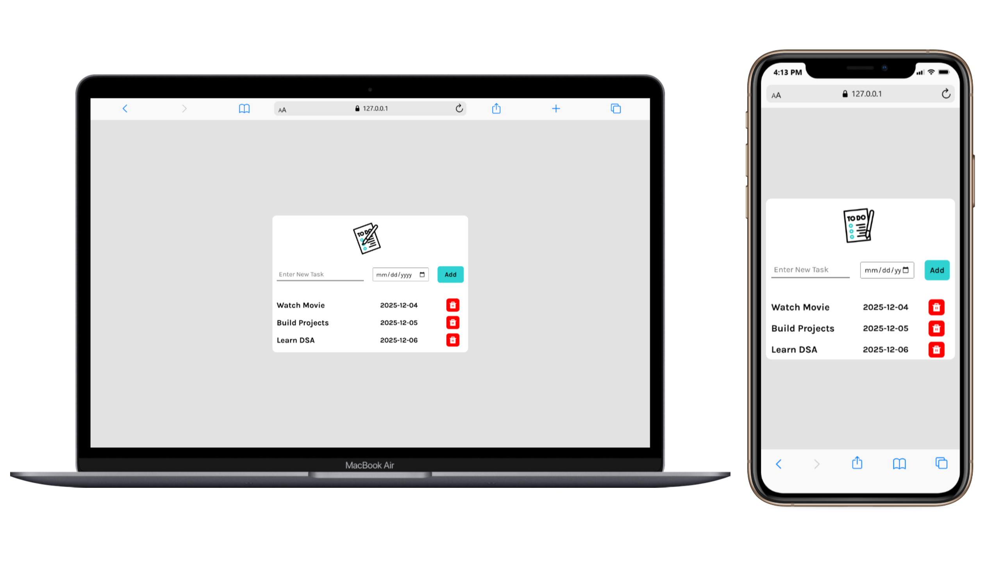

<p align="center">
  
</p>

# 📝 Taskly – Todo App

**Taskly** is a **modern and responsive Todo App** built using **HTML, CSS, and JavaScript**.  
It allows users to **add tasks with deadlines**, view them in a list, and delete tasks dynamically.

This project is ideal for:

✔ Personal task management  
✔ Productivity enhancement  
✔ Learning DOM manipulation with JavaScript  

---

## 📸 Preview

<p align="center">
  
</p>

---

## 🔗 Live Demo

<p align="center">
  <a href="https://anujghimire08.github.io/Taskly-todo-app/">
    
  </a>
</p>

---

## ✨ Features

- Add new tasks with a **task name and deadline date**  
- Dynamic **task list rendering**  
- **Delete tasks** with a single click  
- Modern **responsive design** for desktop & mobile  
- Interactive **buttons and hover effects**  
- Clean **minimal UI with Google Fonts (Karla)**  

---

## 🛠️ Technologies Used

- **HTML5** – Layout & structure  
- **CSS3** – Styling, responsive design, hover effects  
- **JavaScript (ES6)** – Dynamic task list, DOM manipulation  
- **Remix Icons** – For delete button icons  
- **Google Fonts** – Typography  

---

## 📁 Project Structure

```
Taskly-Todo-App/
│── index.html
│── style.css
│── script.js
│── images
```
